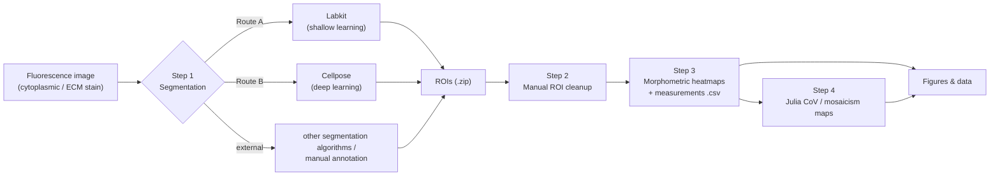
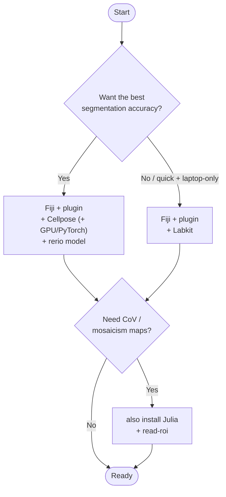
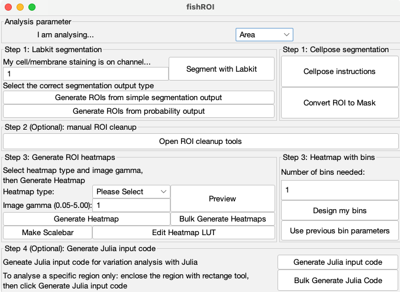
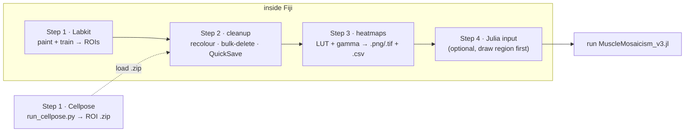

# fishROI — user guide

**fishROI** is an [ImageJ2/Fiji](https://imagej.net/software/fiji/) plugin (written in Jython) for
**semi-automated muscle morphometry in teleost fish** (validated in zebrafish). It takes fluorescence
images of muscle cross-sections, segments individual fibres into ROIs, and turns them into
**morphometric heatmaps** (area, circularity, intensity…) and **spatial coefficient-of-variation
(CoV) maps** that quantify **mosaic hyperplasia**.

> **Paper:** Lu Y, Pan M, Jamwal V, Rahman PHA, Locop J, Ruparelia AA, Currie PD.
> *fishROI: a specialized workflow for semi-automated muscle morphometry analysis in teleosts.*
> **Skeletal Muscle** (2026). https://doi.org/10.1186/s13395-026-00449-y
>
> **Pre-trained models + test images:** Zenodo — https://doi.org/10.5281/zenodo.19223252
> · **Contact:** yansong.lu@monash.edu · KLu@stowers.org

---

## Pipeline at a glance



Every route runs **inside Fiji** except the deep-learning segmentation (Cellpose) and the CoV step
(Julia), which are small standalone tools the plugin hands off to and reads back from.

---

## Three ways to run fishROI

fishROI is one tool with three separate interfaces over the **same** pipeline — pick whichever fits:

| Interface | What it is | Best for |
|---|---|---|
| **Interactive Fiji plugin (GUI)** — [§3](#3-the-manual-workflow-fiji-gui) | The manual, click-through workflow (`fishROI_v1.py`) | Exploring, ROI curation, figure-making |
| **Headless pipeline (CLI / HPC)** — [§4](#4-the-headless-pipeline) | The same steps scripted, no GUI (`automation/`) | Batch runs, reproducibility, clusters |
| **Claude skill** — [§5](#5-the-claude-skill) | An AI assistant that installs dependencies and runs it for you (`skill/fishroi/`) | Hands-off setup and running, no coding |

The GUI plugin is the published tool; the headless pipeline and Claude skill are complementary
automation layers, not a different version of it.

---

## 1. Requirements & dependencies

| Dependency | Needed for | Install link |
|---|---|---|
| **Fiji (ImageJ2)** | **Everything** — the plugin runs here (ships with its own Java) | https://imagej.net/software/fiji/ |
| **fishROI plugin** (`fishROI_v1.py`) | The plugin itself | this repo → [`fishROI_v1.py`](fishROI_v1.py) |
| **Bio-Formats** | Reading vendor microscopy formats (bundled with Fiji) | https://imagej.net/formats/bio-formats |
| **Labkit** | Route A (shallow-learning segmentation) | https://imagej.net/plugins/labkit/ |
| **Cellpose** (`<4`) | Route B (deep-learning segmentation) | https://github.com/MouseLand/cellpose |
| **PyTorch** | GPU acceleration for Cellpose | https://pytorch.org/get-started/locally/ |
| **conda / Miniforge** | Python env for Cellpose + Julia's `read-roi` | https://github.com/conda-forge/miniforge |
| **rerio model** | Best zebrafish accuracy in Cellpose | https://doi.org/10.5281/zenodo.19223252 |
| **Julia** | Step 4 (CoV / mosaicism analysis) | https://julialang.org/downloads/ |
| Julia pkgs: `DataFrames`, `CSV`, `Plots`, [`PyCall`](https://github.com/JuliaPy/PyCall.jl), `Conda` | Step 4 | installed from Julia (below) |
| `read-roi` (conda-forge) | Julia reads ImageJ ROI zips through this | https://anaconda.org/conda-forge/read-roi |

> You only install what your chosen route needs. **Minimum:** Fiji + the plugin (+ Labkit) gets you
> from image → ROIs → heatmaps. Add **Cellpose** for the best segmentation, and **Julia** only if you
> want CoV maps.



---

## 2. Installation

### 2.1 Fiji + the fishROI plugin *(required)*

1. Install **Fiji** for your OS: https://imagej.net/software/fiji/ (Fiji bundles its own Java — no
   separate JDK needed).
2. Download **[`fishROI_v1.py`](fishROI_v1.py)** from this repository.
3. **Drag the `.py` file onto the Fiji main window.** It opens in the **Script Editor**.
4. Click **Run** (bottom-left of the Script Editor).
5. On launch the plugin asks you to **choose a work directory**. Everything for a run is read from and
   written to this folder — `config.json` (remembers your settings), ROI `.zip`s, heatmaps, and the
   Julia input `.txt`. **Use one folder per experiment** and keep each image's files together with a
   **consistent base filename** (the heatmap and Julia steps match files by name).

The plugin is **modular**: tick only the panels you need, leave the rest blank, and come back later.

### 2.2 Labkit — Route A *(shallow learning)*

1. In Fiji: **Help → Update ImageJ… → Manage Update Sites**.
2. Tick **Labkit**, click **Apply and Close**, and **restart Fiji** when prompted.
3. Docs: https://imagej.net/plugins/labkit/ · pixel-classification tutorial:
   https://imagej.github.io/plugins/labkit/pixel-classification-tutorial

You do **not** need Labkit if you use Cellpose.

### 2.3 Cellpose + rerio model — Route B *(deep learning)*

Cellpose runs **outside Fiji** as a standalone script ([`run_cellpose.py`](run_cellpose.py)).

```bash
# 1. create an isolated environment (Miniforge/conda recommended)
conda create -n cellpose python=3.10 -y
conda activate cellpose

# 2. install Cellpose (pin <4 — Cellpose 4.x is SAM-based and breaks the cyto3 / rerio models)
python -m pip install "cellpose<4"

# 3. GPU (optional but recommended): install a CUDA-enabled PyTorch build for your CUDA version
#    from https://pytorch.org/get-started/locally/ . CPU-only works, just slower.
#    NOTE: Cellpose GPU needs a CUDA-capable (NVIDIA) GPU — AMD and Intel GPUs are not supported.
```

**Model:** start with the stock **`cyto3`** model (already good on cytoplasmic staining). For the
best zebrafish accuracy, download the authors' custom **`rerio`** model from Zenodo
(https://doi.org/10.5281/zenodo.19223252), note its **path on disk**, and point `run_cellpose.py` at
it. Full parameters and the FIJI round-trip are in
[`skill/fishroi/references/cellpose-cli.md`](skill/fishroi/references/cellpose-cli.md).

### 2.4 Julia — Step 4 *(CoV / mosaicism, optional)*

1. Install **Julia**: https://julialang.org/downloads/ (any recent stable release).
2. Start Julia, press `]` to enter the package manager (`pkg>`), then:
   ```julia
   pkg> add DataFrames CSV Plots PyCall Conda
   ```
3. Press **Backspace** to return to `julia>`, then wire up the Python bridge that reads ImageJ ROI
   zips:
   ```julia
   using Conda
   Conda.add("read-roi", channel="conda-forge")
   ENV["PYTHON"] = ""          # make PyCall use Conda's own Python
   using Pkg
   Pkg.build("PyCall")
   ```
4. `exit()`. This one-time setup is per machine. Setting `ENV["PYTHON"]=""` **before**
   `Pkg.build("PyCall")` is the critical step. Details + troubleshooting:
   [`skill/fishroi/references/julia-mosaicism.md`](skill/fishroi/references/julia-mosaicism.md).

---

## 3. The manual workflow (Fiji GUI)

The plugin opens as a single modular panel: the four numbered **Steps** run top-to-bottom, and you
only use the panels you need. The button and field names below match the interface exactly.





### Panel map

| GUI control (exact label) | What it does |
|---|---|
| **Analysis parameter → "I am analysing…"** (dropdown) | The measurement that drives Step 3 heatmaps and Step 4 Julia code: `Area`, `Circ.`, `Mean`/`Max`/`Min` intensity, `Feret`, … |
| **Step 1: Labkit segmentation → "My cell/membrane staining is on channel…"** | Channel number of your fibre-delineating stain (cytoplasmic phalloidin recommended) |
| **"Segment with Labkit"** | Opens the current image in Labkit to paint labels and train |
| **"Generate ROIs from simple segmentation output"** / **"Generate ROIs from probability output"** | Turn a Labkit (or external) **binary mask** / **probability map** into ROIs |
| **Step 1: Cellpose segmentation → "Cellpose instructions"** | Displays the standalone-Cellpose steps (Route B) |
| **"Convert ROI to Mask"** | Exports curated ROIs as label-mask PNGs (e.g. to train a Cellpose model) |
| **Step 2 (Optional) → "Open ROI cleanup tools"** | Random-colour, bulk-delete, and QuickSave tools for manual curation |
| **Step 3: Generate ROI heatmaps → "Heatmap type"**, **"Image gamma (0.05–5.00)"** | Pick a LUT + gamma, then **Preview** / **"Generate Heatmap"** / **"Bulk Generate Heatmaps"** |
| **"Make Scalebar"**, **"Edit Heatmap LUT"** | A figure-matching colour ramp; customise the LUT |
| **Step 3: Heatmap with bins → "Number of bins needed"**, **"Design my bins"**, **"Use previous bin parameters"** | Map value ranges to discrete colour classes |
| **Step 4 (Optional) → "Generate Julia input code"** / **"Bulk Generate Julia Code"** | Writes the Julia input for CoV analysis (enclose a region with the rectangle tool first to restrict it) |

### Step 1 — Segmentation

**Route A · Labkit (in Fiji).** In the **Step 1: Labkit segmentation** panel, set
**"My cell/membrane staining is on channel…"** to the channel of your fibre-delineating stain
(cytoplasmic **phalloidin** recommended) and click **"Segment with Labkit"**. Paint a few
foreground/background labels and train, then in Labkit choose **Segmentation → Show Segmentation
Result** (binary) *or* **Probability Map**. Back in the plugin, click
**"Generate ROIs from simple segmentation output"** (binary) or
**"Generate ROIs from probability output"** (probability map); ensure membranes are white (Invert if
prompted), set size/circularity in **Analyze Particles**, and confirm. ROIs are saved as a `.zip` in
the work directory. *(These "Generate ROIs…" buttons also accept external segmentation maps — binary
or probability — exported from other tools.)*

**Route B · Cellpose (standalone).** Click **"Cellpose instructions"** (Step 1: Cellpose
segmentation) for a summary, then edit and run [`run_cellpose.py`](run_cellpose.py) outside Fiji. Back
in Fiji, open the **original image** and load the resulting ROI `.zip` (**ROI Manager → More ▸ →
Open**). *(Use **"Convert ROI to Mask"** to export curated ROIs as Cellpose training masks.)*

### Step 2 — Manual cleanup *(recommended)*
Click **"Open ROI cleanup tools"** (Step 2 panel). Use **random colouring** to spot merged fibres,
draw a selection and bulk-**remove** everything inside it, and **QuickSave** to snapshot the ROI set to
a dated folder.

### Step 3 — Morphometric heatmaps
Set the **"I am analysing…"** measurement, then in **Step 3: Generate ROI heatmaps** pick a
**"Heatmap type"** and **"Image gamma (0.05–5.00)"**, click **Preview**, and click
**"Generate Heatmap"** (or **"Bulk Generate Heatmaps"** to run every image in a folder with a matching
ROI `.zip`). Use **Step 3: Heatmap with bins** (**"Number of bins needed"** → **"Design my bins"**)
for discrete colour classes, and **"Make Scalebar"** for a figure-matching ramp. This step also writes
the per-ROI **measurements `.csv`** used by Step 4.

### Step 4 — Julia CoV / mosaicism *(optional)*
In **Step 4: Generate Julia input code**, enclose a region with the **rectangle tool** first to
restrict the analysis (otherwise the whole section is used), then click **"Generate Julia input code"**
(or **"Bulk Generate Julia Code"**). Paste the generated block at the end of
[`MuscleMosaicism_v3.jl`](MuscleMosaicism_v3.jl) (stack multiple samples if you like), then:
```julia
julia> cd("directory_of_julia_script")
julia> include("MuscleMosaicism_v3.jl")
```
CoV is computed in a sliding window of radius **3× the mean Feret diameter**; elevated local CoV marks
**growth zones / active mosaic hyperplasia**.

---

## 4. The headless pipeline

The whole pipeline can run **without the GUI** — one command does segment → Fiji-identical measure →
area heatmap → Julia CoV. The rerio model is fetched + checksum-verified automatically; Fiji is
auto-detected (installed if absent).

```bash
pip install tifffile numpy pandas scikit-image scipy matplotlib roifile opencv-python-headless
pip install "cellpose<4" torch

python automation/fishroi_run_all.py \
    --image "DR test image.tif" --outdir out/ --seg-channel 1 \
    --julia-script MuscleMosaicism_v3.jl        # omit to skip the CoV step
```

**Per image you get:** `*_rois.zip`, a Fiji-identical `*_measurements.csv`, `*_area_heatmap.png/.tif`
(the paper's inverted `phase` LUT + min/max scale bar), and Julia µ/σ/CoV maps in `out/julia/`.

**Keep the manual-curation checkpoint** by splitting the run:
```bash
python automation/fishroi_run_all.py --image img.tif --outdir out/ --segment-only          # Phase A
"$FIJI" --run automation/fishroi_curate.py 'image="img.tif",roizip="out/img_rois.zip"'      # curate (GUI)
python automation/fishroi_run_all.py --image img.tif --outdir out/ --roizip out/img_rois.zip \
    --julia-script MuscleMosaicism_v3.jl                                                     # Phase B
```

- **HPC:** `automation/hpc/` has SLURM templates (GPU segment array → CPU analyze array) — see
  [`automation/hpc/README.md`](automation/hpc/README.md).
- **No Fiji?** `automation/fishroi_auto.py` is a pure-Python fallback (scikit-image measurements,
  ~5–10 % off the plugin's absolute area/circularity; CoV ~2 %). Use `fishroi_run_all.py` for
  plugin-identical numbers.
- **Prefer a hands-off run?** An AI-guided **Claude skill** automates all of this — see §5.

---

## 5. The Claude skill

For a hands-off experience the repo ships a **Claude skill** — an AI assistant that reads your
intent, installs the right dependencies, and runs the appropriate route (GUI, headless, or HPC) for
you, with no coding required. It lives in [`skill/fishroi/`](skill/fishroi/) (a router `SKILL.md`
plus the reference docs below).

- **In Claude Code or the Claude app:** open this repo and ask for fishROI — the skill triggers on
  muscle-morphometry / fishROI requests and walks you through setup and each analysis step.
- It covers the same Steps 1–4 as the GUI and can drive the headless pipeline in §4.

---

## 6. Detailed references & troubleshooting

Deep-dive docs (setup, every button, and troubleshooting tables) live under
[`skill/fishroi/references/`](skill/fishroi/references/):

| Topic | Doc |
|---|---|
| Fiji plugin + Labkit, GUI map, Steps 1–4 | [`fiji-setup.md`](skill/fishroi/references/fiji-setup.md) |
| Cellpose install, model, parameters, round-trip | [`cellpose-cli.md`](skill/fishroi/references/cellpose-cli.md) |
| Julia environment, input code, outputs | [`julia-mosaicism.md`](skill/fishroi/references/julia-mosaicism.md) |
| Headless pipeline internals & fidelity | [`automation.md`](skill/fishroi/references/automation.md) |
| Biology / method background | [`background.md`](skill/fishroi/references/background.md) |

---

## 7. Citation

If you use fishROI, please cite:

> Lu Y, Pan M, Jamwal V, Rahman PHA, Locop J, Ruparelia AA, Currie PD.
> **fishROI: a specialized workflow for semi-automated muscle morphometry analysis in teleosts.**
> *Skeletal Muscle* (2026). https://doi.org/10.1186/s13395-026-00449-y

Models and test images: Zenodo — https://doi.org/10.5281/zenodo.19223252

## License

See [`LICENSE`](LICENSE). Questions / issues: open a GitHub issue or email yansong.lu@monash.edu ·
KLu@stowers.org.
